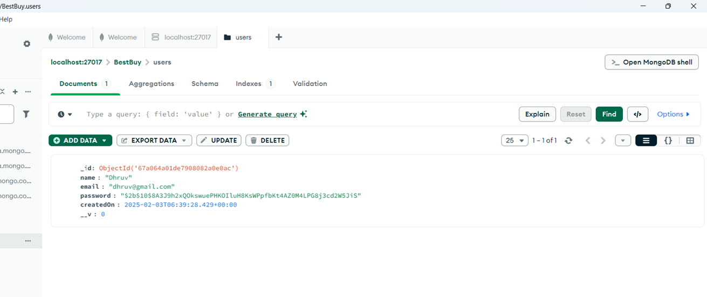

## Best Buy: MERN based E-commerce Application 🛒

### Live App : [Link](https://best-buy-frontend-topaz.vercel.app)
### Demo : [Link](https://drive.google.com/file/d/11qXYFyH4JWadc-iHrwF9za3U3rUPCRmE/view?usp=drive_link)

## Features : 
###    **🎯 Product Filtration, Sorting, Pagination:** 
- Navigate through a large catalog of products.
- Filter products based on various criteria like price range, category etc.
- Sort products based on price, popularity and more.
###    **💳 Secure order system:** Offering both COD and Stripe payments options for enhanced transaction security and flexibility
###    **🖥️ Admin Dashboard:** Enabling efficient inventory tracking, order processing, and user management
###    **🧑‍💻 User Account Management:** with Password Recovery, Profile Editing 

## Test User Credentials
| User Credentials | Admin Credentials |
|:----------|:-----------|
| Email: test.user.0123459876@gmail.com | Email: test.adm.0123459876@gmail.com |
| Password: testuser@123 | Password: testadmin@123 |

## Stripe Card Number : 4000003560000008 | 4000003560000123

## Tech Stack : 
- React
- Node.js
- Express.js
- MongoDB
- Redux Toolkit
- Tailwind CSS
- JWT
- Bcrypt
- Stripe
- Cloudinary

## Homepage

